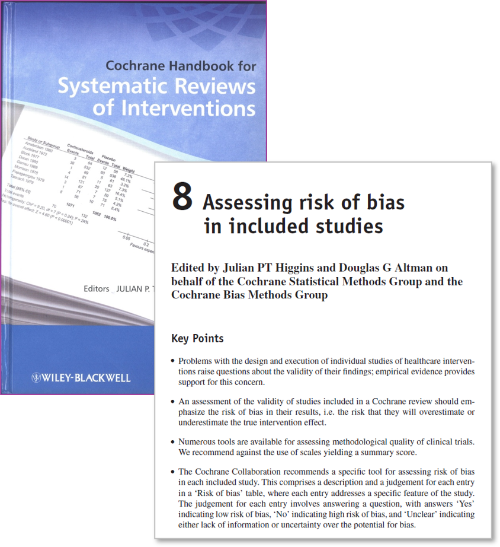
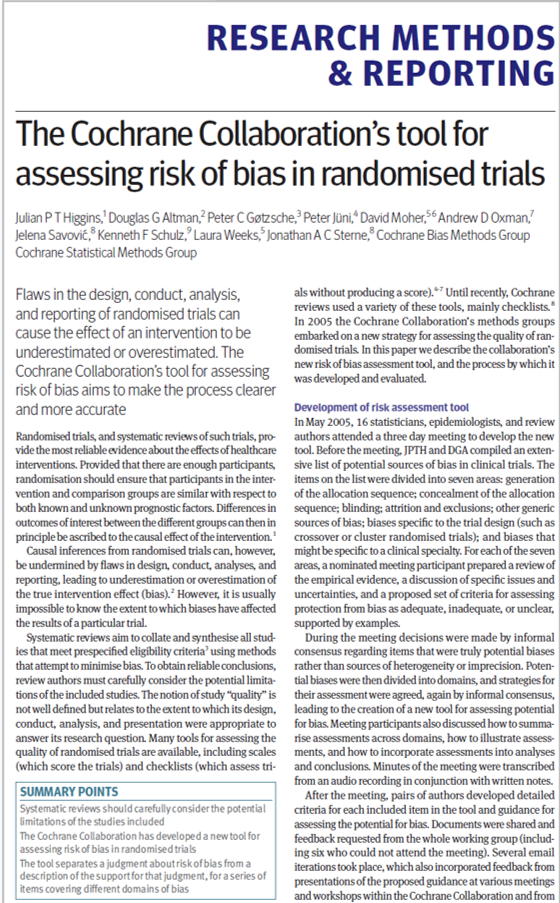
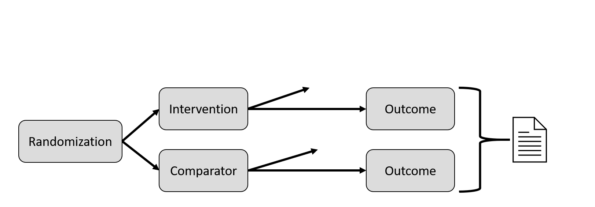
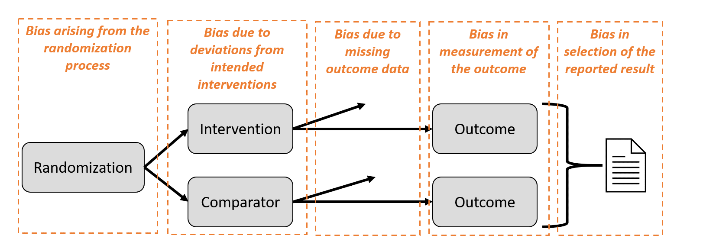
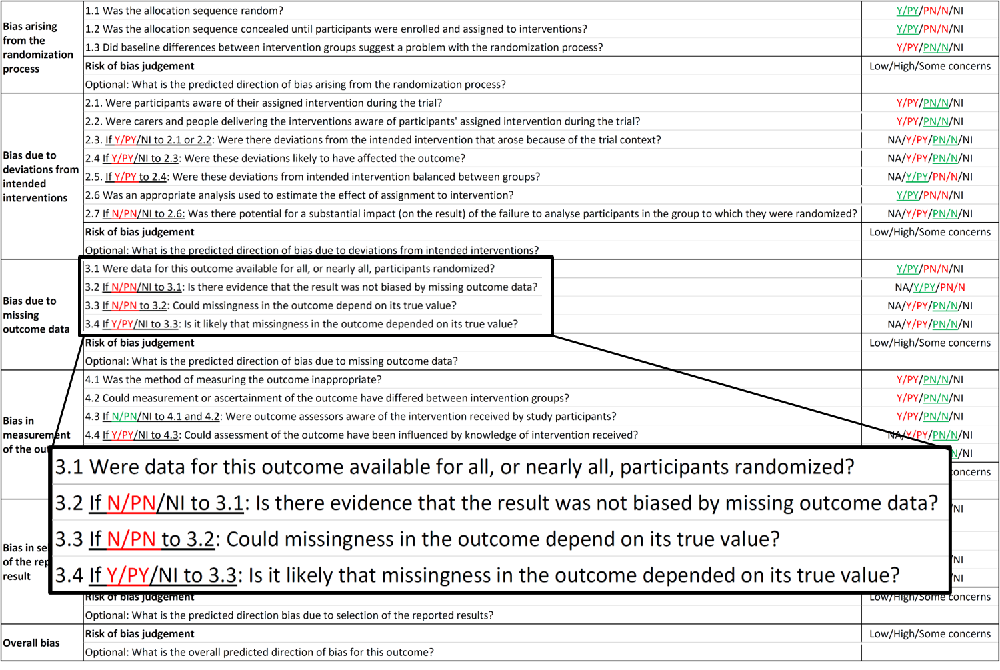
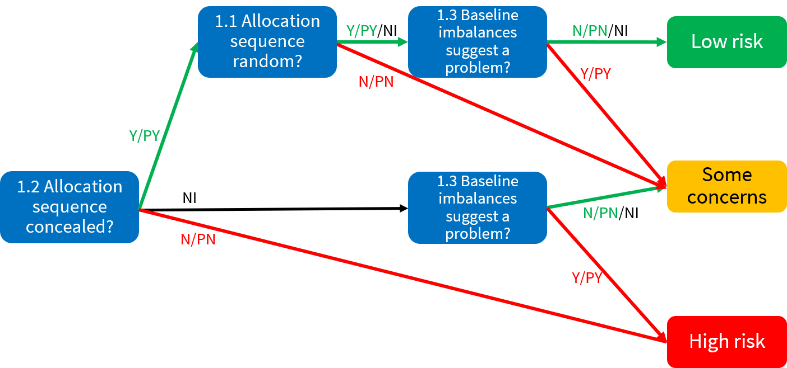

```{r setup, include=FALSE}
options(htmltools.dir.version = FALSE)
knitr::opts_chunk$set(include = FALSE)
```

``` {r, echo = FALSE, message = FALSE}
htmltools::includeCSS("https://raw.githubusercontent.com/malcolmbarrett/kakashi/master/kakashi.css")
library(medrxivr)
cache <- TRUE
library(dplyr)
xaringanExtra::use_xaringan_extra(c("tile_view", "webcam"))
xaringanExtra::use_editable(expires = 1)
```

class: large

## Overview of this course

* Advance course for RoB2 

???

__Don't forget to introduce yourself__

* NIHR DRF/PhD Student
* Working in BARR wiht Julian Higgins
* Presented previous webinar on this tool and asked back
* Delivered
* Work mainly on incorporate of RoB into analyses

(today and tomorrow)

--

* Structure
  - Session I + Practical
  - Coffee break ☕
  - Session II + Practical
  - Discussion 🗣

???

Session introducing domain, followed by practical to apply it

--

Materials: __https://mcguinlu.github.io/ESI-ROB2-intro/__

???

Slides for today available now

Cover how to download - any issues let me know.

---

## Zoom etiquette

.larger[Yes/No check-marks for __rapid feedback__]

???

Practice run - reactions tab on Zoom

<hr>

--

<br>

.larger[Questions]

???

Please add questions to the chat as we go along - question breaks built into the sessions <hr>

--

<br>

.larger[Discussion]

???

* During discussion, please say your name at the start, as I can't easily tell who is talking

---

# Acknowledgements/Declarations

.small[
Slides based in part on training delivered by: Julian Higgins, Jonathan Sterne, Jelena Savović, Matthew Page, Asbjørn Hróbjartsson, Isabelle Boutron, Theresa Moore & Alexandra McAleenan

I am supported by an National Institute for Health Research (NIHR; https://www.nihr.ac.uk/) Doctoral Research Fellowship (DRF-2018-11-ST2-048).

ROB2 development supported by the MRC Network of Hubs for Trials Methodology Research (MR/L004933/1- N61). Infrastructure support was provided by the Medical Research Council ConDuCT-II Hub (Collaboration and innovation for Difficult and Complex randomized controlled Trials In Invasive procedures – MR/K025643/1).
]

???

MRC and NIHR as relevant funders

---

# ROB2 Core Group
.small[
__Core group:__ Julian Higgins, Jonathan Sterne, Jelena Savović, Matthew Page, Asbjørn Hróbjartsson, Isabelle Boutron, Barney Reeves, Roy Elbers

__Contributors:__ Natalie Blencowe, Marion Campbell, Mike Campbell, Christopher Cates, Vincent Cheng, Rachel Churchill, Mark Corbett, Nicky Cullum, Francois Curtin, Amy Drahota, Sandra Eldridge, Jonathan Emberson, Bruno Giraudeau, Jeremy Grimshaw, Miguel Hernán, Sally Hopewell, Daniela Junqueira, Peter Jüni, Jamie Kirkham, Toby Lasserson, Tianjing Li, Alexandra McAleenan, Stephen Senn, Sasha Shepperd, Ian Shrier, Nandi Siegfried, Lesley Stewart, Kate Tilling, Ian White, Penny Whiting

__Further acknowledgements:__ Doug Altman, Henning Keinke Andersen, Mike Clarke, Jon Deeks, Sharea Ijaz, Geraldine MacDonald, Richard Morris, Mona Nasser, Nishith Patel, Jani Ruotsalainen, Holger Schünemann, Jayne Tierney
]

???

Huge number of people worked on this tool

You'll note my name is not there

---

class: large

## What this course will enable you to do

* Create a __content outline__ for a session on RoB 2

???

All with an aim to prepare you for __deliver__ introductory training on the RoB 2 tool to others.

--

* Identify __sticking points__ in the adoption and application of RoB 2 

--

* Address__ common questions/issues__ regarding the tool

???

Throughout, I have sought to provide links to further reading and relevant empirical studies, so that you can support your explanations.

---

class: inverse, center, middle

# Context and motivation

---

## What is bias?

A __systematic error__, or deviation from the truth, in results

--

Bias is <u>__not__</u> the same as:

.tricolumn[
.tricolhead[
### Imprecision
]
.small[
Random error due to sampling variation

Reflected in the confidence interval
]
]

???

Imprecision refers to random error. Each time trialists take a sample and measure outcomes, they will get natural variation from the ‘true’ values in the whole population. 
The smaller the sample, the more variability. Imprecision is reflected in the confidence interval around the treatment effect. 
<hr>

--

.tricolumn[
.tricolhead[
### Quality
]
.small[
Bias can occur in <br>well-conducted studies

Not all methodological <br>flaws introduce bias
]
]

???

Bias is not the same as quality in study conduct:  The RoB team moved substantially away from methods found in other tools – which often assess – methodological quality” of the trial – or “did the trialists do the best they can do..?” 
Whereas… Bias focuses on “Do I believe the result?”

Also not all markers of “poor conduct” in trials are relevant to bias. For example, failure to perform a sample size calculation, or to obtain ethical approval, are important markers of study quality, but they are unlikely to have direct implications for risk of  bias.

<hr>

--

.tricolumn[
.tricolhead[
### Reporting
]
.small[
Good methods may have been used but not well reported 
]
]

???

Bias is not the same as the quality of reporting
Studies rarely have space to report the methods used in exhaustive detail and may often have used rigorous methods even if they are not described in the published paper. 

Reporting is improving with initiatives like the CONSORT statement. It is important not to discriminate against older trials that were published before these initiatives, and for us to be clear- in our  assessments of bias - in these trials – whether our decisions are based on methods reported in the paper, and when the details are not reported in the trial.. .some tools to assess trials for RCTs have confused these issues

---
class: center, middle


.larger[__Bias__]

wrong answer to the right question


.largest[
$\neq$
]


.larger[__Generalisability / Indirectness__]

right answer to the wrong question 


???

Bias also not the same as concerns re generalisability

Indirectness = just because you are not studying the population of interest, doesn't mean the answer is biased.

---

# Cochrane Risk of Bias tool (RoB 1)

.pull-left[

]
.pull-right[


]

???

The first ROB tool was developed and published in 2008 with revisions in 2011 

It has been used by 100% of Cochrane reviews of interventions since 2014


---

## Problems with existing tool (RoB 1)

Used __simplistically__ & __inconsistently__

???

__1__ Guidance not followed, and domains added or removed

<hr>

--

Modest __agreement rates__ between assessors

???

__2__ This was partly influence by the overuse of the unclear judgement, which was itself ambiguous.

Can provide references for this if you want
<hr>

--

Issues around __unblinded trials__

???

__3__ Issues with the domain of blinding with users assuming that no blinding meant high risk of bias – which was not what the team had intended and was not  in the guidance.

<hr>

--

No __overall__ risk-of-bias judgement

???

__4__ Problematic if you want to carry result of forward for sensitivity analyses/etc. , which we will explore tomorrow afternoon (__SIGNPOST__)

---

## .center[Motivation for ROB2]

<br>
.pull-left[.center[.larger[More __accurate__]]]
<br>
<br>
???
__1__ more comprehensive
more guidance and structure to improve consistency
versions appropriate to cluster-randomized trials, cross-over trials
<hr>

--
.pull-right[.center[.larger[More __usable__]]]
<br>
<br>
???
???
__2__ 
clearer guidance, in-built help in reaching judgements
<hr>

--

.pull-left[.center[<br>.larger[More __current__]]]
<br>
???
__3__
incorporates developments in the science (particularly missing data, unblinded trials)
<hr>

--

.pull-right[.center[<br>.larger[More __useful__]]]

???
__4__
overall risk of bias judgement feeds into sensitivity analyses/exploration of heterogeneity
allied to ROBINS-I for non-randomized studies

<hr>

---

class: inverse, center, middle

# RoB2 Key Features

---

## RoB2 assess risk of bias

---

## Bias in randomised trials



???

Bias introduced through conduct/dissemination of results

These aspects are based on empirical research and theory

May be familiar, but worth checking how they are defined within the RoB 2 tool

__Note:__ Only for RCTs - for non-randomised studies, check ROBINS-I

__Note:__ for the purposes of this course, we will be focusing on standard RCTS (rather than cluster or other RCTs).

There are additional issues in cross-over trials and cluster-randomized trials, and different versions of RoB 2 have been developed for these designs.


---

## Bias in randomised trials



???

Domains map onto the elements or domains of bias

---

## Signalling questions

Reasonably factual __signalling questions__ aim to facilitate judgements and increase transparency

???

**Example:** Q1.1 - Was the allocation sequence random?

--

Possible responses: .g[‘__Yes__’], .g[‘__Probably yes__’], .r[‘__Probably no__’], .r[‘__No__’], ‘__No information__’
]

Authors encouraged to record __rationale__ and __direct quotes__

???

Helps transparency and in resolving discrepancies

---

{width=50%}

???

Here is the entire tool – not for reading but just so you get an idea of the size. 

There are in total twenty-three (23) signalling questions across the 5 domains 

But due to conditional questioning, you may not have to answer all 23. 

A key example is Domain 3 – “Bias due to Missing Outcome Data”

If you answer “Yes/Probably Yes” to the first signalling questions – “Were data for this outcome available for all, or nearly all, participants randomised?” – you do not need to answer any further questions.


---

## Domain-level judgements

Possible judgements:
* .g[‘Low risk of bias’]
* ‘Some concerns’
* .r[‘High risk of bias’]

???

--

__Algorithms__ provided suggested domain-level judgements

???

Based on responses to signalling questions. Example of these on the next slide

--

Suggested risk-of-bias judgements __can be over-ridden__


---

## Example domain-level algorithm


???

Domain 1 has three SQ

Answers guide you to domain-level judgement

Note: "No information" is incorporated as a judgement


---

## Overall risk of bias

.left-column[.g[__Low risk of bias__]]
The study is judged to be at __low risk of bias__ for all domains _for this result_.

???

Overall risk of bias judgement follows from the domain-level judgements (can be over-ridden)

--

.left-column[.sc[__Some concerns__]<br><br>]

The study is judged to be at __some concerns__ in at least one domain _for this result_, and no domains are at high risk of bias


--
.left-column[.r[__High risk of bias__<br><br><br><br><br>]]

`#`1 - The study is judged to be at __high risk of bias__ in at least one domain _for this result_.<br>
--
`#`2 - The study is judged to have __some concerns__ for multiple domains in a way that substantially lowers confidence _in this result_.

???

__SIGNPOST:__ When I say there are two ways to get there, I talking about the algorithms that we use to go from domain level judgements to overall judgements

---

class: large

# Resources

[riskofbias.info](https://www.riskofbias.info)

???

Linked from course website

--

Cochrane Handbook - Chapter __7__ & __8__

--

Templates:
* Word template
* Excel tool (___recommended___)
* Online software (_coming soon_)

???

Recommend doing the practical exercises in Excel template - may need to enable macros

Available from course website

---

class: middle, center

.pull-left[  ]

.pull-right[
<br>
<br>
<br>
.largest[__Questions?__]
]

---

## Why that order?

Introduce bias


---

class: center, inverse, middle

# Practical I

---

class: center

## Lesson plans

.small[
```{r, include = TRUE, echo=FALSE}

read.csv(here::here("day1/lesson_plans.csv"), stringsAsFactors = F) %>%
  replace(is.na(.),"") %>%
  mutate(across(starts_with("v"), ~"")) %>%
  mutate(topic = ifelse(v == "","|",topic)) %>%
  rename_with(~c("Topic","1 hour","2 hours","Half day","Full day")) %>%
  knitr::kable(align = c("lcccc")) %>%
  kableExtra::column_spec(1,bold = T, width = "50em") %>%
  kableExtra::column_spec(2:5, width = "10em")
```
]

???

These are the topics that I think are the most important - follows the outline for the Intro course, and the recap given earlier.

Run through them and explain what they mean

Some of you may be more peadogolically inclined, and plan your lessons in a fancier way, but this is just a thought exercise

---

class: center

## Lesson Plans - 1 hour
 
.small[
```{r, include = TRUE, echo=FALSE}

read.csv(here::here("day1/lesson_plans.csv"), stringsAsFactors = F) %>%
  replace(is.na(.),"") %>%
  mutate(across(starts_with("vv"), ~"")) %>%
  mutate(topic = ifelse(v == "","|",topic)) %>%
  rename_with(~c("Topic","1 hour","2 hours","Half day","Full day")) %>%
  knitr::kable(align = c("lcccc")) %>%
  kableExtra::column_spec(1,bold = T, width = "50em") %>%
  kableExtra::column_spec(2:5, width = "10em")
```
]

???

Purpose of covering the first two domains is to allow users to see what they look like (Domain 1, randomisation is a really easy example), and to explore the different between assignment and adherence. 

---

class: center

## Lesson Plans - 2 hour
 
.small[
```{r, include = TRUE, echo=FALSE}

read.csv(here::here("day1/lesson_plans.csv"), stringsAsFactors = F) %>%
  replace(is.na(.),"") %>%
  mutate(across(starts_with("vvv"), ~"")) %>%
  
  mutate(topic = ifelse(vv == "","|",topic)) %>%
  rename_with(~c("Topic","1 hour","2 hours","Half day","Full day")) %>%
  knitr::kable(align = c("lcccc")) %>%
  kableExtra::column_spec(1,bold = T, width = "50em") %>%
  kableExtra::column_spec(2:5, width = "10em")
```
]

---

class: center

## Lesson Plans - Half day
 
.small[
```{r, include = TRUE, echo=FALSE}

read.csv(here::here("day1/lesson_plans.csv"), stringsAsFactors = F) %>%
  replace(is.na(.),"") %>%
  mutate(across(starts_with("vvvv"), ~"")) %>%
  
  mutate(topic = ifelse(vvv == "","|",topic)) %>%
  rename_with(~c("Topic","1 hour","2 hours","Half day","Full day")) %>%
  knitr::kable(align = c("lcccc")) %>%
  kableExtra::column_spec(1,bold = T, width = "50em") %>%
  kableExtra::column_spec(2:5, width = "10em")
```
]

???

One of the interesting additional things to note here is the addition of a comparison with the old tool - for longer courses, it is impo

For shorter course, it is maybe not as important.

---

class: center

## Lesson Plans - Full day
 
.small[
```{r, include = TRUE, echo=FALSE}

read.csv(here::here("day1/lesson_plans.csv"), stringsAsFactors = F) %>%
  replace(is.na(.),"") %>%
  rename_with(~c("Topic","1 hour","2 hours","Half day","Full day")) %>%
  knitr::kable(align = c("lcccc")) %>%
  kableExtra::column_spec(1,bold = T, width = "50em") %>% 
  kableExtra::column_spec(2:5, width = "10em")
```
]

---

## Topics to cover

* Comparison with ROB
  * Harder
  * More difficult to apply
* Bias as a concept
* Domains, how defined, how to deal with extra
* Applying at scale - no good answer

  
(hard to apply, results-based assessment, assignment vs adherence, disagreement with the algorithms, applicability to cluster trials)

  
---

class: inverse, center, middle

# Issue: Result-focused tool

---

## RoB2 is a result-focused tool

It assesses a __single outcome__ at a __single timepoint__

<br>

???
Essentially assessing a single numerical result chosen


More specific than study/outcome based


This approach is taken because biases in a study could act unequally across the study.


--

.tricolumn[
.tricolhead[
### Outcome
]

Depression


]

--

.tricolumn[
.tricolhead[
### Measure
]
Beck's Depression<br>Inventory

]

--

.tricolumn[
.tricolhead[
### Time point
]

12 weeks

]

---

## Contrast with previous tools

This will be a particular issue for those who have only used Cochrane Risk of Bias

& highlight why it is import

Relatedly: whatever result you assess should eb the result used in the meta-analysis

???

With result based tools, Strange things can often happen in terms of authors assessing a result for risk of bias and then including a different result

The important thing is you are assessing the validity of what goes into the meta-analysis.

For example, with ROBINS-I, authors can

---

class: inverse, center, middle

# Issue: Domains

---

## Domains

Fixed set of __five__ domains

???

__1.__ Rather than a score or checklist, Cochrane Reviews assess the risk of bias in results of included studies using a domain-based approach. 

--

All domains are __mandatory__

--

Additional domains (e.g. "other biases") __should not be added__

--

Issues around __funding/COIs __are handled elsewhere

???

__4.__ See TACIT (Tool for Addressing Conflicts of Interest in Trials)
However, the impact of the conflicts on bias in a trial result will operate through one of the fixed domains of the RoB 2 tool.]

--

__Reporting biases__ handled elsewhere e.g. ROB-ME

---

## Common query is how were these domains identified

.footer[*Page et al. (2016), doi: [10.1371/journal.pone.0159267](https://www.doi.org/10.1371/journal.pone.0159267)*)]

---

class: inverse, center, middle

Issue: Complexity

---

## RoB 2 is a complex tool

Common complaint is complexity

RoB assessment comparable to peer review

???

I don't think this is a bad thing

Doing complex tasks well takes time

---

class: inverse, center, middle

# Issue: Inter-rater reliability

---

## Inter-rater reliability can be low

Studies show poor in

Assessments are inherently subjective - depend on reviewers experience and areas of practice

Highlights the point of performing it in duplicate and then resolving discrepancies

Additionally, other scales (Cochrane RoB, Jadad) do not perform better on inter-rater relaiability

.footer2[*Minozzi et al. (2020) doi: [10.1016/j.jclinepi.2020.06.015](https://www.doi.org/10.1016/j.jclinepi.2020.06.015), Minozzi et al. (2020) doi: [10.1016/j.jclinepi.2020.06.015](https://www.doi.org/10.1016/j.jclinepi.2020.06.015)*]

---

## Sharing justifications

Users should publish the support for thier judgements

Like

We are also interested in it for meta-epi reasons


---

## Visualising and incorporating results

Many users simle


---

class: inverse, center, middle

# Discussion

