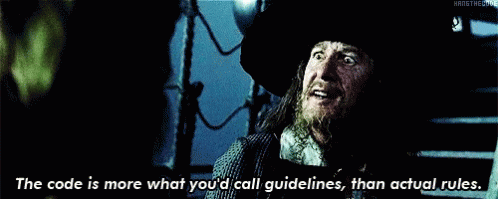

```{r setup, include=FALSE}
options(htmltools.dir.version = FALSE)
knitr::opts_chunk$set(include = FALSE)
```

``` {r, echo = FALSE, message = FALSE}
htmltools::includeCSS("https://raw.githubusercontent.com/malcolmbarrett/kakashi/master/kakashi.css")
library(medrxivr)
cache <- TRUE
library(dplyr)
xaringanExtra::use_xaringan_extra(c("tile_view", "webcam"))
xaringanExtra::use_editable(expires = 1)
```

class: large

## Overview of this course

* Advanced course for RoB2 trainers

???

__Don't forget to introduce yourself__

* NIHR DRF/PhD Student
* Working in BARR wiht Julian Higgins
* Delivered ESI Intro to RoB2 training earlier in the summer
* Work mainly on incorporate of RoB into analyses

This course is for those who attended the course in July/have extensive experience of the tool.

<hr>

--

* Structure
  - Session I + Practical
  - Coffee break ☕
  - Session II + Practical
  - Discussion 🗣

???

Session introducing domain, followed by practical to apply it

See that there is a long discussion period scheduled for last thing, to address your questions and issues

<hr>

--

* Materials: [https://mcguinlu.github.io/ESI-ROB2-intro/](https://mcguinlu.github.io/ESI-ROB2-intro/)

???

Slides for today available now, along with files for the practicals.

Cover how to download - any issues let me know.

<hr>

__BREATHE!!__

---

## Zoom etiquette

.larger[Yes/No check-marks (for __rapid feedback__])

???

Practice run - reactions tab on Zoom

<hr>

--

<br>

.larger[Questions]

???

Please add questions to the chat as we go along - question breaks built into the sessions <hr>

--

<br>

.larger[Discussion (please say your __name__)]

???

* During discussion, please say your name at the start, as I can't easily tell who is talking

---

# Acknowledgements/Declarations

.smaller[
Slides based in part on training delivered by: Julian Higgins, Jonathan Sterne, Jelena Savović, Matthew Page, Asbjørn Hróbjartsson, Isabelle Boutron, Theresa Moore & Alexandra McAleenan

I am supported by an National Institute for Health Research (NIHR; https://www.nihr.ac.uk/) Doctoral Research Fellowship (DRF-2018-11-ST2-048).

ROB2 development supported by the MRC Network of Hubs for Trials Methodology Research (MR/L004933/1- N61). Infrastructure support was provided by the Medical Research Council ConDuCT-II Hub (Collaboration and innovation for Difficult and Complex randomized controlled Trials In Invasive procedures – MR/K025643/1).
]

???

MRC and NIHR as relevant funders

---

# ROB2 Core Group
.smaller[
__Core group:__ Julian Higgins, Jonathan Sterne, Jelena Savović, Matthew Page, Asbjørn Hróbjartsson, Isabelle Boutron, Barney Reeves, Roy Elbers

__Contributors:__ Natalie Blencowe, Marion Campbell, Mike Campbell, Christopher Cates, Vincent Cheng, Rachel Churchill, Mark Corbett, Nicky Cullum, Francois Curtin, Amy Drahota, Sandra Eldridge, Jonathan Emberson, Bruno Giraudeau, Jeremy Grimshaw, Miguel Hernán, Sally Hopewell, Daniela Junqueira, Peter Jüni, Jamie Kirkham, Toby Lasserson, Tianjing Li, Alexandra McAleenan, Stephen Senn, Sasha Shepperd, Ian Shrier, Nandi Siegfried, Lesley Stewart, Kate Tilling, Ian White, Penny Whiting

__Further acknowledgements:__ Doug Altman, Henning Keinke Andersen, Mike Clarke, Jon Deeks, Sharea Ijaz, Geraldine MacDonald, Richard Morris, Mona Nasser, Nishith Patel, Jani Ruotsalainen, Holger Schünemann, Jayne Tierney
]

???

Huge number of people worked on this tool

You'll note my name is not there

---

class: large

## What this course will enable you to do

* Create a __content outline__ for a session on RoB 2

???

What is the point of this course?

<hr>

All with an aim to prepare you for __deliver__ introductory training on the RoB 2 tool to others.

--

* Identify __sticking points__ in the adoption and application of RoB 2 

--

* Address__ common questions/issues__ regarding the tool

???

<hr>

Throughout, I have sought to provide links to further reading and relevant empirical studies, so that you can support your explanations.

---

class: inverse, center, middle

# Recap of introductory course/<br>Order of topics

???

I'm going to try something a little bit different today, and run through the original Intro coures both to:
* Recap briefly on what was covered
* Justify the order of introduction

---

## What is bias?

A __systematic error__, or deviation from the truth, in results

???

Good place to start - introduces bias and makes sure attendees are clear on the point of the tool.

In particular, good to distinguish from:

--

Bias is <u>__not__</u> the same as:

.tricolumn[
.tricolhead[
### Imprecision
]
]

???

Imprecision refers to random error. Each time trialists take a sample and measure outcomes, they will get natural variation from the ‘true’ values in the whole population. 
The smaller the sample, the more variability. Imprecision is reflected in the confidence interval around the treatment effect. 
<hr>

--

.tricolumn[
.tricolhead[
### Quality
]
]

???

Bias is not the same as quality in study conduct:  The RoB team moved substantially away from methods found in other tools – which often assess – methodological quality” of the trial – or “did the trialists do the best they can do..?” 
Whereas… Bias focuses on “Do I believe the result?”

Also not all markers of “poor conduct” in trials are relevant to bias. For example, failure to perform a sample size calculation, or to obtain ethical approval, are important markers of study quality, but they are unlikely to have direct implications for risk of  bias.

<hr>

--

.tricolumn[
.tricolhead[
### Reporting
]
]

???

Bias is not the same as the quality of reporting
Studies rarely have space to report the methods used in exhaustive detail and may often have used rigorous methods even if they are not described in the published paper. 

Reporting is improving with initiatives like the CONSORT statement. It is important not to discriminate against older trials that were published before these initiatives, and for us to be clear- in our  assessments of bias - in these trials – whether our decisions are based on methods reported in the paper, and when the details are not reported in the trial.. .some tools to assess trials for RCTs have confused these issues

---

# Cochrane Risk of Bias tool (RoB 1)

.pull-left[

]
.pull-right[


]

???

We then covered the original tool, the Cochrane Risk of Bias tool.

Presenting RoB2 in the context of the original tool allows you to __bring along anyone__ who has used the original version and provide a __brief history lesson__ for anyone who hasn't.

Might not want to include this, __depending on time__

<hr>

The first ROB tool was developed and published in 2008 with revisions in 2011 

It has been used by 100% of Cochrane reviews of interventions since 2014


---

## Problems with existing tool (RoB 1)

Used __simplistically__ & __inconsistently__

Modest __agreement rates__ between assessors.

Issues around __unblinded trials__

No __overall__ risk-of-bias judgement

---

## .center[Motivation for ROB2]

<br>
.pull-left[.center[.larger[More __accurate__]]]
<br>
<br>

.pull-right[.center[.larger[More __usable__]]]
<br>
<br>

.pull-left[.center[<br>.larger[More __current__]]]
<br>

.pull-right[.center[<br>.larger[More __useful__]]]

???

Run through justification for new tool - providing some examples of each issue. So for usable, you might make reference to better guidance, algorithms

All of this introductory material is building towards:

---

class: inverse, center, middle

# RoB2 Key Features

---

class: center, middle

## RoB2 assess <u>risk of bias</u>

---

## Bias in randomised trials


???
We next spoke about the design of a standard radomised

We next spoke about the domains of bia

This is a really nic

Bias introduced through conduct/dissemination of results

These aspects are based on empirical research and theory

May be familiar, but worth checking how they are defined within the RoB 2 tool

__Note:__ Only for RCTs - for non-randomised studies, check ROBINS-I

__Note:__ for the purposes of this course, we will be focusing on standard RCTS (rather than cluster or other RCTs).

There are additional issues in cross-over trials and cluster-randomized trials, and different versions of RoB 2 have been developed for these designs.


---

## Bias in randomised trials


???

Domains map onto the elements or domains of bias

---

## Signalling questions

Reasonably factual __signalling questions__ aim to facilitate judgements and increase transparency

???

**Example:** Q1.1 - Was the allocation sequence random?

--

Possible responses: .g[‘__Yes__’], .g[‘__Probably yes__’], .r[‘__Probably no__’], .r[‘__No__’], ‘__No information__’
]

Authors encouraged to record __rationale__ and __direct quotes__

???

Helps transparency and in resolving discrepancies

---

{width=50%}

???

Here is the entire tool – not for reading but just so you get an idea of the size. 

There are in total twenty-three (23) signalling questions across the 5 domains 

But due to conditional questioning, you may not have to answer all 23. 

A key example is Domain 3 – “Bias due to Missing Outcome Data”

If you answer “Yes/Probably Yes” to the first signalling questions – “Were data for this outcome available for all, or nearly all, participants randomised?” – you do not need to answer any further questions.


---

## Domain-level judgements

Possible judgements:
* .g[‘Low risk of bias’]
* ‘Some concerns’
* .r[‘High risk of bias’]

???

--

__Algorithms__ provided suggested domain-level judgements

???

Based on responses to signalling questions. Example of these on the next slide

--

Suggested risk-of-bias judgements __can be over-ridden__


---

## Example domain-level algorithm


???

Domain 1 has three SQ

Answers guide you to domain-level judgement

Note: "No information" is incorporated as a judgement


---

## Overall risk of bias

.left-column[.g[__Low risk of bias__]]
The study is judged to be at __low risk of bias__ for all domains _for this result_.

???

Overall risk of bias judgement follows from the domain-level judgements (can be over-ridden)

--

.left-column[.sc[__Some concerns__]<br><br>]

The study is judged to be at __some concerns__ in at least one domain _for this result_, and no domains are at high risk of bias


--
.left-column[.r[__High risk of bias__<br><br><br><br><br>]]

`#`1 - The study is judged to be at __high risk of bias__ in at least one domain _for this result_.<br>
--
`#`2 - The study is judged to have __some concerns__ for multiple domains in a way that substantially lowers confidence _in this result_.

???

__SIGNPOST:__ When I say there are two ways to get there, I talking about the algorithms that we use to go from domain level judgements to overall judgements

---

class: large

# Resources

[riskofbias.info](https://www.riskofbias.info)

???

Linked from course website

--

Cochrane Handbook - Chapter __7__ & __8__

--

Templates:
* Word template
* Excel tool (___recommended___)
* Online software (_coming soon_)

???

Recommend doing the practical exercises in Excel template - may need to enable macros

Available from course website

---

class: center, middle

# RoB2 walk-through:<br>Preliminary considerations

???

At this point, we transitioned from introductory material to working through the tool properly, starting with the preliminary considerations.

---


???

We then looked at the inital stage of the preliminart considerations.

Recommend just presenting a screenshot of the tool - common to all walkthrough sections.

Important things to highlight:
  * There are three versions of the tool
    * Individually randomised, 
    * Cluster randomised, and 
    * Individually randomised cross-over
    
  * Need to define:
    * Comparison
    * Numerical results (HAMMER HOME IT IS RESULT, NOT STUDY, BASED)
    * Effect of interest (SIGNPOST TO DOMAIN 2)

---

class: middle

 

???

Simpler aspect of preliminary considerations.

__But__ encourage users to find and use all available information on the trial

Important to get most holistic picture of studies

Trials different from other types of studies as there are often multiple documents availale.

---

class: middle, center

# RoB2 walk-through:<br>Domains

???

At this point I walk throught the domains of bias include in the tool.

Depending on length, I will vary which domains I include and the level of detail I will go into on them

---

##  Visualising and incorporating the results
.larger[
.pull-left[
.small[
Risk-of-bias assessments are performed __BUT__ data is relegated to the supplementary material

Better to try and __pair__ the assessments to their respective results

Also useful to perform __sub-group meta-analysis__ by risk-of-bias level
]
]
]

.pull-right[


]

???

The final thing I will discuss, time allowing, is whether

Specifically, I'll encourage users to use the results of the ROB assessments.

As it's insufficient to simply perform the assessments, create the figure and not actively think about what this means for your meta-analysis

<hr>

And that's the end of the session.

---

## Assessing assignment vs adherence

Common query is __when to introduce__ this aspect of the tool

--

<br>

__Preferred option:__
  * Make users aware when discussing __preliminary considerations__

--
  
  * Discuss in detail when walking-through __Domain 2__

???

One important thing to note here is that this approach means Domain 2 should be covered in all sessions, regardless of length

---

## Review of order of topics

.smaller[
* Introduce bias as a concept
]

--
.smaller[
* Discuss motivation & compare with previous tool & discussion (_optional_)
]
--
.smaller[
* Discuss key features
  * Results based tool
  * Domains of bias
  * Signalling questions & algorithms
  * Domain-level and overall judgements
]

--

.smaller[
* Resources for performing assessments
]

--

.smaller[
* Domain walk-through (varying levels of detail possible)
]

--

.smaller[
* Incorporating & visualising results
]

???

Think of three steps:
  * Setting groundwork/context for the tool proper, including resources
  * Describe and walk-through tool proper
  * Discuss what to do with results when complete


---

class: middle, center

.pull-left[  ]

.pull-right[
<br>
<br>
<br>
.largest[__Questions?__]
]

---

class: center, inverse, middle

# Practical

---

class: center

## Lesson plans

.small[
```{r, include = TRUE, echo=FALSE}

read.csv(here::here("day1/lesson_plans.csv"), stringsAsFactors = F) %>%
  replace(is.na(.),"") %>%
  mutate(across(starts_with("v"), ~"")) %>%
  mutate(topic = ifelse(v == "","|",topic)) %>%
  rename_with(~c("Topic","1 hour","2 hours","Half day","Full day")) %>%
  knitr::kable(align = c("lcccc")) %>%
  kableExtra::column_spec(1,bold = T, width = "50em") %>%
  kableExtra::column_spec(2:5, width = "10em")
```
]

???


Some of you may be more peadogolically inclined, and plan your lessons in a fancier way, but this is just a thought exercise

---

class: center

## Lesson Plans - 1 hour
 
.small[
```{r, include = TRUE, echo=FALSE}

read.csv(here::here("day1/lesson_plans.csv"), stringsAsFactors = F) %>%
  replace(is.na(.),"") %>%
  mutate(across(starts_with("vv"), ~"")) %>%
  mutate(topic = ifelse(v == "","|",topic)) %>%
  rename_with(~c("Topic","1 hour","2 hours","Half day","Full day")) %>%
  knitr::kable(align = c("lcccc")) %>%
  kableExtra::column_spec(1,bold = T, width = "50em") %>%
  kableExtra::column_spec(2:5, width = "10em")
```
]

???

Purpose of covering the first two domains is to allow users to see what they look like (Domain 1, randomisation is a really easy example), and to explore the different between assignment and adherence. 

---

class: center

## Lesson Plans - 2 hour
 
.small[
```{r, include = TRUE, echo=FALSE}

read.csv(here::here("day1/lesson_plans.csv"), stringsAsFactors = F) %>%
  replace(is.na(.),"") %>%
  mutate(across(starts_with("vvv"), ~"")) %>%
  
  mutate(topic = ifelse(vv == "","|",topic)) %>%
  rename_with(~c("Topic","1 hour","2 hours","Half day","Full day")) %>%
  knitr::kable(align = c("lcccc")) %>%
  kableExtra::column_spec(1,bold = T, width = "50em") %>%
  kableExtra::column_spec(2:5, width = "10em")
```
]

---

class: center

## Lesson Plans - Half day
 
.small[
```{r, include = TRUE, echo=FALSE}

read.csv(here::here("day1/lesson_plans.csv"), stringsAsFactors = F) %>%
  replace(is.na(.),"") %>%
  mutate(across(starts_with("vvvv"), ~"")) %>%
  
  mutate(topic = ifelse(vvv == "","|",topic)) %>%
  rename_with(~c("Topic","1 hour","2 hours","Half day","Full day")) %>%
  knitr::kable(align = c("lcccc")) %>%
  kableExtra::column_spec(1,bold = T, width = "50em") %>%
  kableExtra::column_spec(2:5, width = "10em")
```
]

???

One of the interesting additional things to note here is the addition of a comparison with the old tool - for longer courses, it is impo

For shorter course, it is maybe not as important.

---

class: center

## Lesson Plans - Full day
 
.small[
```{r, include = TRUE, echo=FALSE}

read.csv(here::here("day1/lesson_plans.csv"), stringsAsFactors = F) %>%
  replace(is.na(.),"") %>%
  rename_with(~c("Topic","1 hour","2 hours","Half day","Full day")) %>%
  knitr::kable(align = c("lcccc")) %>%
  kableExtra::column_spec(1,bold = T, width = "50em") %>% 
  kableExtra::column_spec(2:5, width = "10em")
```
]


???

These are the topics that I think are the most important - follows the outline for the Intro course, and the recap given earlier.

__BUT__ not exhaustive - you may think a specific topic needs more information, or should be cut as it is confusing.


<!-- TODO ## Topics to cover -->

<!-- * Comparison with ROB -->
<!--   * Harder -->
<!--   * More difficult to apply -->
<!-- * Bias as a concept -->
<!-- * Domains, how defined, how to deal with extra -->
<!-- * Applying at scale - no good answer -->


<!-- (hard to apply, results-based assessment, assignment vs adherence, disagreement with the algorithms, applicability to cluster trials) -->

---

class: center, middle

# Issue: Complexity

???

Going to start with the biggest issue that comes up all the time!

---

## RoB 2 is a complex tool

Common complaints:
* __Complexity__ of assessment
* Time taken to apply tool

???

Big issue here is that opinions on how l

--

RoB assessment comparable to peer review

--

<br>

.center[__Doing complex things well takes time__]

???

I don't think this is a bad thing

---

class: inverse, center, middle

# Issue: Bias verus generalisability

---

## RoB 2: Common sticking points/issues

__Some common issues__ crop up repeatedly in RoB2 teaching

Collected from __multiple trainers__ across __multiple sessions__

???

Loosely grouped here by topic for ease of reference.

Have tried to present them in to order you will encounter them when presenting on the tool.

---

class: center, middle

# Issue: Bias verus generalisability

???

__Arises:__ discussion of bias in the context of RoB2

---
class: center, middle


.larger[__Bias__]

wrong answer to the right question


.largest[
$\neq$
]


.larger[__Generalisability / Indirectness__]

right answer to the wrong question 


???

Bias also not the same as concerns re generalisability

Indirectness = just because you are not studying the population of interest, doesn't mean the answer is biased.

---

## Generalisability

Also called __indirectness__ or __applicability__ or __external validity__

Caused by differences in __population__, __intervention__ or __outcome__

Handled in __GRADE__ framework

--

Distinct from bias or __internal validity__

???

Differences between study populations within a systematic review are a common problem for systematic review authors and guideline panels. When this occurs evidence is indirect.

An example is differing populations - review of children under 10 includes study with children and teenagers. 

Result may not be applicable to review, because teenagers are included, but __it is not biased__

--

<br>
.center[__NO IMPACT ON RISK OF BIAS ASSESSMENT__]

---

class: center, middle

# Issue: Result-focused tool

???

__Arises:__ when introducing the RoB2 framework and focus on a numerical results

---

## RoB2 is a result-focused tool

It assesses a __single outcome__ at a __single timepoint__

<br>

.tricolumn[
.tricolhead[
### Outcome
]

Depression


]

.tricolumn[
.tricolhead[
### Measure
]
Beck's Depression<br>Inventory

]

.tricolumn[
.tricolhead[
### Time point
]

12 weeks

]

???

__Remember: RoB2 is a results focused tool!__

More specific than anything else

---

## RoB2 is a results focused tool

This issue is common among __users of other tools__


--

E.g. __different drop-out rates__ at _12 weeks_ and _1 year_ outcomes

???

Different drop-out rates might give different overall risk of bias and so a single study level judgement is not appropriate

--

<br>
.center[
__The result assessed should be the result<br> used in the meta-analysis__
]

???

With result based tools, Strange things can often happen in terms of authors assessing a result for risk of bias and then including a different result

The important thing is you are assessing the validity of what goes into the meta-analysis.

For example, with ROBINS-I, authors can

---

class: center, middle

# Issue: Domains

---

## Risk-of-bias domains

Fixed set of __five__ domains

???

__1.__ Rather than a score or checklist, Cochrane Reviews assess the risk of bias in results of included studies using a domain-based approach. 

--

All domains are __mandatory__

--

Additional domains (e.g. "other biases") __should not be added__

--

Issues around __funding/COIs __are handled elsewhere

???

__4.__ See TACIT (Tool for Addressing Conflicts of Interest in Trials)
However, the impact of the conflicts on bias in a trial result will operate through one of the fixed domains of the RoB 2 tool.]

--

__Reporting biases__ handled elsewhere e.g. ROB-ME

---

## Common query is how were these domains identified

Based on __empirical evidence__ about how bias operators in trials

Supported by review of how __Cochrane RoB tool__ was applied

Point questioner towards supporting literature:
* *Page et al. (2016), doi: [10.1371/journal.pone.0159267](https://www.doi.org/10.1371/journal.pone.0159267)*
* *Jørgensen et al. (2016), doi: [10.1186/s13643-016-0259-8](https://www.doi.org/10.1186/s13643-016-0259-8)*

---

class: middle, center

.pull-left[  ]

.pull-right[
<br>
<br>
<br>
.largest[__Questions?__]
]

---

class: inverse, center, middle

# Issue: Yes vs Probably Yes

---

## Response options can be confusing

__Reminder:__ the possible responses to signalling questions:
* .g[‘__Yes__’]
* .g[‘__Probably yes__’]
* .r[‘__Probably no__’]
* .r[‘__No__’]
* ‘No information’

<br>
.center[
__Definite__ vs __probable__ indicates level of certainty
]

???

First time users are often unsure of whether to respond with the definite or probable

A good idea here is to present two responses to the same question where one is slightly less clear.

Important to note as well that they are considered the same from the algorithms point of view.

---

class: center, middle

## Issue: Disagreeing with the algorithm

---

class: center

## Algorithms suggest domain-level judgement


---

## Users take algorithm as gospel

Algorithms are __suggested__ judgements

???

Many reviewers don't feel confident enough to diagree with the algorithm

<hr>

--

```{r, out.width='100%', include=T, echo=F}

```

???

As trainers, remind users they can disgree the domain level-algorithm 

---

class: center, middle

# Issue: Inter-rater reliability

---

## Inter-rater reliability can be low

Studies show poor __inter-rater reliability__

Assessments are __inherently subjective__

.footer2[*Minozzi et al. (2020) doi: [10.1016/j.jclinepi.2020.06.015](https://www.doi.org/10.1016/j.jclinepi.2020.06.015)*]


???

Unsurprising as assessments are subjective - depend on reviewers experience and areas of practice

--

Highlight the __recommended approach__:
  * Perform in duplicate and 
  * Resolve discrepancies through discussion

???

If you get this question, highlight the best approach.

--

Other scales (Cochrane RoB, Jadad) __do not perform better__ on inter-rater relaiability

???

Additionally, other tools are not necessicarily better - if all bad for IRR, when not chose the most valid tool?

---

class: center, middle

## Issue: Implementation

---

## Applying at scale

RoB2 is __difficult to apply__ at scale (e.g. HTA)

???

RoB2 is a complex tool and so applying at scale (>10s of results) can be challenging

--

__Options:__
  * Only assess results __in meta-analysis__
  * __Fail-fast__ approach
  

|         |  D1 |  D2  | D3 | D4 | D5 | Overall |
|:-------:|:---:|:----:|:--:|:--:|:--:|:-------:|
| Study 1 | Low | High |  ~ |  ~ |  ~ |   High  |

???

Another option, discussed at the end of the last course, is to use core outcome sets if available, to whittle down list

---

## Resources to support implementation

__Common criticisms:__
  * the lack of guidance
  * guidance is too dense

???

Loads of support now - Cochrane webinars, ESI webinars, 

Re: guidance being too dense - refer back to complex tool and issues 

???

This is probably the critism

Re: guidance being dense - refer back to complex tool

--

<br>
__Resources:__  
* [riskofbias.info](https://www.riskofbias.info)
* Cochrane Handbook - Chapter __7__ & __8__
* Excel tool - built in __guidance/algorithms__
* Online software (_coming soon_)

---

class: center, middle

## Issue: Visualising and incorporating RoB 2 results

---

## Visualising and incorporating RoB 2 results

Many users simply perform the assessments and __don't use them__

<br>

__Could perform:__
  * Sensitivity analysis (_exclude high ROB studies_)
  * Sub-group meta-analysis
  * Meta-regression

???

You should encourage them to use the results of the risk of bias assessment

---

## Methods for visualisation

Support for new methods including __paired forest plots__ in `robvis`


???

Not much help to non-R users at the moment, but will eventually trickle down...

---

## Sharing justifications

Users should publish the support for their judgements

Like

We are also interested in it for meta-epi reasons

???

On a related note in terms of reporting, you should encourage users

This ties back in with the inter-rater reliability we discussed earlier

---

class: middle, center

.pull-left[  ]

.pull-right[
<br>
<br>
<br>
.largest[__Questions?__]
]

---

class: inverse, center, middle

# Practical

???

Document available from the course website. Main purpose is to get you thinking about some of the issues I mentioned, and spark some discussion points.

---

### Q1. What are the advantages of RoB2 over the original Cochrane risk of bias tool? Why should I use it instead if it is harder to apply?

--

* Discuss __limitations__ of original tool

* Highlight __advantages__ of new tool

---

### Q2. My review is focused on the effect of the intervention in children under 10, but one study included both children and teenagers – is this a risk of bias issue?

--

.r[__No__]

This is an __applicability/indirectness__ problem

Handled by the __GRADE__ framework

---

### Q3. I have finished performing risk-of-bias assessments for all results in my review. What should I do with the results of the assessments?

--

* Discuss __RoB data__ in detail in results

* Produce __visualisation__, ideally __paired with forest plot__

* Investigate __impact of RoB level on effect estimate__ (sub-group meta-analysis/meta-regression)

---

### Q4. I am conducting a very large review (> 100 results). What results should I assess for risk of bias? How do I apply RoB 2 at scale?

--

* __Limit to results__ included in the meta-analysis/core outcomes

* Use __fail-fast__ approach

* Justify your descisions

---

### Q5. What resources exist to help me manage and apply RoB2 in my review?

--

[riskofbias.info](https://www.riskofbias.info)

Cochrane Handbook - Chapter __7__ & __8__

Templates:
* Word template
* Excel tool (___recommended___)
* Online software (_coming soon_)

???

Website is one-stop shop for all things risk of bias.

---

### Q6. I am concerned that some studies including in my review were funded by a pharmaceutical company. Can I add an extra domain to the tool to capture this conflict of interest? 

--

.r[__No__]

Domains are __fixed__ - cannot add or remove

Conflicts of interest captured by __TACIT __tool

__BUT__ impact of the COIs on bias in a trial result __will operate through one of the fixed domains__ of the RoB 2 tool

---

class: inverse, center, middle

# Discussion

